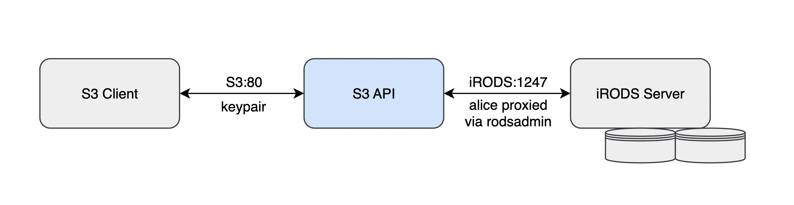

# iRODS S3 API

A project that presents an iRODS Zone as S3 compatible storage.



Implements a subset of the Amazon S3 API:
  - https://docs.aws.amazon.com/AmazonS3/latest/API/API_Operations.html

This API currently supports:
  - [x] AbortMultipartUpload
  - [x] CopyObject
  - [x] CompleteMultipartUpload
  - [x] CreateMultipartUpload
  - [x] DeleteObject
  - [x] DeleteObjects
  - [x] GetBucketLocation
  - [x] GetObject
  - GetObjectAcl ?
  - [x] GetObjectLockConfiguration
  - [x] GetObjectTagging
  - [x] HeadBucket
  - [x] HeadObject
  - [x] ListBuckets
  - ListObjects ?
  - [x] ListObjectsV2
  - [x] PutObject
  - PutObjectAcl ?
  - PutObjectTagging ?
  - [x] UploadPart
  - UploadPartCopy ?

The goal is to support the equivalent of:
 - ils - `aws s3 ls s3://bucketname/a/b/c/`
 - iput - `aws s3 cp localfile s3://bucketname/a/b/c/filename`
 - iget - `aws s3 cp s3://bucketname/a/b/c/filename localfile`
 - irm - `aws s3 rm s3://bucketname/a/b/c/filename`
 - imv - `aws s3 mv s3://bucketname/a/b/c/filename1 s3://bucketname/a/b/c/filename2`

# Limitations / What's Missing

## Multipart

Multipart has not been implemented for copy operations where `x-amz-copy-source` and `x-amz-copy-source-range` are used.
When performing a copy from one iRODS file to another, multipart should be disabled.

See [Disabling Multipart](#disabling-multipart) for details.

Multipart uploads of a local file is supported.

## Tagging

iRODS has its own metadata system, however it is not especially clear how it should map to S3 metadata, so it is not
included at the moment.

## Paging

Paging requires engineering work to provide paging through lists of objects efficiently, so right now this API does not
attempt to paginate its output for things such as listobjects.

## Checksum handling

Amazon S3 provides many ways to communicate checksums for the data as received by the server. iRODS provides MD5 checksums, 
however this API does not use that to verify data objects created through PutObject.

## ETags

ETags are not provided for or used consistently.

## Versioning

Versioning is not supported at this time.

# Docker

This project provides two Dockerfiles, one for building and one for running the application.

**IMPORTANT: All commands in the sections that follow assume you are located in the root of the repository.**

## The Builder Image

The builder image is responsible for building the iRODS S3 API package. Before you can use it, you must build the image. To do that, run the following:
```bash
docker build -t irods-s3-api-builder -f irods_builder.Dockerfile .
```

With the builder image in hand, all that's left is to compile the source code for the S3 API project. The builder image is designed to compile code sitting on your machine. This is important because it gives you the ability to build any fork or branch of the project.

Building the package requires mounting the project into the container at the appropriate location. The command you run should look similar to the one below. Don't forget to create the directory which will hold your package!
```bash
docker run -it --rm \
    -v /path/to/irods_client_s3_api:/s3_api_source:ro \
    -v /path/to/packages_directory:/packages_output \
    irods-s3-api-builder
```

If everything succeeds, you will have a DEB package in the local directory you mapped to **/packages_output**.

### Using a build cache

In order to keep build artifacts around for faster iteration on build times, include another volume mount for `/_build_s3_api` into which build artifacts can be stored in the host filesystem:
```bash
docker run -it --rm \
    -v /path/to/irods_client_s3_api:/s3_api_source:ro \
    -v /path/to/build_directory:/_build_s3_api \
    -v /path/to/packages_directory:/packages_output \
    irods-s3-api-builder
```

## The Runner Image

The runner image is responsible for running the iRODS S3 API. Building the runner image requires the DEB package for the iRODS S3 API to exist on the local machine. See the previous section for details on generating the package.

To build the image, run the following command:
```bash
docker build -t irods-s3-api-runner -f irods_runner.Dockerfile /path/to/packages/directory
```

If all goes well, you will have a containerized iRODS S3 API server! You can verify this by checking the version information. Below is an example.
```bash
$ docker run -it --rm irods-s3-api-runner -v
irods_s3_api <version>-<build_sha>
```

## Launching the Container

To run the containerized server, you need to provide a configuration file at the correct location. If you do not have a configuration file already, see [Configuration](#configuration) for details.

To launch the server, run the following command:
```bash
docker run -d --rm --name irods_s3_api \
    -v /path/to/config/file:/config.json:ro \
    -p 9000:9000 \
    irods-s3-api-runner
```

The first thing the server will do is validate the configuration. If the configuration fails validation, the server will exit immediately. If the configuration passes validation, then congratulations, you now have a working iRODS S3 API server!

You can view the log output using `docker logs -f` or by passing `-it` to `docker run` instead of `-d`.

If for some reason the default schema file is not sufficient, you can instruct the iRODS S3 API to use a different schema file. See the following example.
```bash
# Generate the default JSON schema.
docker run -it --rm irods-s3-api-runner --dump-default-jsonschema > schema.json

# Tweak the schema.
vim schema.json

# Launch the server with the new schema file.
docker run -d --rm --name irods_s3_api \
    -v /path/to/config/file:/config.json:ro \
    -v ./schema.json:/jsonschema.json:ro \
    -p 9000:9000 \
    irods-s3-api-runner \
    --jsonschema-file /jsonschema.json
```

## Stopping the Container

If the container was launched with `-it`, use **CTRL-C** or `docker container stop <container_name>` to shut it down.

If the container was launched with `-d`, use `docker container stop <container_name>`.

# Building and running without Docker

## Build Dependencies

- iRODS development package
- iRODS externals package for boost
- iRODS externals package for nlohmann-json
- iRODS externals package for spdlog
- Curl development package
- OpenSSL development package

## Building from source

This project relies on git submodules and Docker for building the server.

Before the server can be built, you must download the appropriate git submodules. You can do that by running the following:

```bash
git submodule update --init --recursive
```

To build, follow the normal CMake steps.

```bash
mkdir build # Preferably outside of the repository
cd build
cmake /path/to/repository
make package # Use -j to use more parallelism.
```

Upon success, you should have an installable package.

If you run into issues, try checking if the git submodules exist on your machine.

## Running without Docker

The server has three requirements that must be satisfied before launch. They are listed as follows:
- Python 3 must be installed
- Python 3 jsonschema module must be installed
- A valid configuration file for the iRODS S3 API server

The Python requirements can be satisfied by using your OS's package manager and `python3 -m pip`. We'll leave that as an exercise for the reader.

Now, you need a configuration file for the iRODS S3 API. See [Configuration](#configuration) for details on how to create one.

With the requirements satisfied, run the following to launch the server:
```bash
irods_s3_api /path/to/config.json
```

To stop the server, you can use **CTRL-C** or send **SIGINT** or **SIGTERM** to the process.

# Configuration

Before you can run the server, you'll need to create a configuration file.

You can generate a configuration file by running the following:
```bash
irods_s3_api --dump-config-template > config.json
```

**IMPORTANT: `--dump-config-template` does not produce a fully working configuration. It must be updated before it can be used.**

## Configuration File Structure

The JSON structure below represents the default configuration.

Notice how some of the configuration values are wrapped in angle brackets (e.g. `"<string>"`). These are placeholder values that must be updated before launch.

**IMPORTANT: The comments in the JSON structure are there for explanatory purposes and must not be included in your configuration. Failing to follow this requirement will result in the server failing to start up.**

```js
{
    // Defines options that affect how the client-facing component of the
    // server behaves.
    "s3_server": {
        // The hostname or IP address to bind.
        // "0.0.0.0" instructs the server to listen on all network interfaces.
        "host": "0.0.0.0",

        // The port used to accept incoming client requests.
        "port": 9000,

        // The minimum log level needed before logging activity.
        //
        // The following values are supported:
        // - trace
        // - debug
        // - info
        // - warn
        // - error
        // - critical
        "log_level": "info",

        // Defines the set of plugins to load.
        "plugins": {
            //
            // Each key corresponds to a plugin's .so file name, minus the
            // "lib" prefix.
            //

            "static_bucket_resolver": {
                // The internal name assigned to the plugin.
                "name": "static_bucket_resolver",

                // Defines the mapping between bucket names and iRODS
                // collections.
                "mappings": {
                    "<bucket_name>": "/path/to/collection"
                }
            },

            "static_authentication_resolver": {
                // The internal name assigned to the plugin.
                "name": "static_authentication_resolver",

                // Defines information for resolving an S3 username to an
                // iRODS username.
                "users": {
                    // Maps <s3_username> to a specific iRODS user.
                    // Each iRODS user that intends to access the S3 API must
                    // have at least one entry.
                    "<s3_username>": {
                        // The iRODS username to resolve to.
                        "username": "<string>",

                        // The secret key used to authenticate with the S3
                        // API for this user.
                        "secret_key": "<string>"
                    }
                }
            }
        },

        // Defines the region the server will report as being a member of.
        "region": "us-east-1",

        // Defines the location where part files are temporarily stored
        // on the irods_s3_api server before being streamed to iRODS. 
        "multipart_upload_part_files_directory": "/tmp",

        // Defines options that affect various authentication schemes.
        "authentication": {
            // The amount of time that must pass before checking for expired
            // bearer tokens.
            "eviction_check_interval_in_seconds": 60,

            // Defines options for the "Basic" authentication scheme.
            "basic": {
                // The amount of time before a user's authentication
                // token expires.
                "timeout_in_seconds": 3600
            }
        },

        // Defines options that affect how client requests are handled.
        "requests": {
            // The number of threads dedicated to servicing client requests.
            // When adjusting this value, consider adjusting "background_io/threads"
            // and "irods_client/connection_pool/size" as well.
            "threads": 3,

            // The maximum size allowed for the body of a request.
            "max_size_of_request_body_in_bytes": 8388608,

            // The amount of time allowed to service a request. If the timeout
            // is exceeded, the client's connection is terminated immediately.
            "timeout_in_seconds": 30
        },

        // Defines options that affect tasks running in the background.
        // These options are primarily related to long-running tasks.
        "background_io": {
            // The number of threads dedicated to background I/O.
            "threads": 6
        }
    },

    // Defines iRODS connection information.
    "irods_client": {
        // The hostname or IP of the target iRODS server.
        "host": "<string>",

        // The port of the target iRODS server.
        "port": 1247,

        // The zone of the target iRODS server.
        "zone": "<string>",

        // Defines options for secure communication with the target iRODS server.
        "tls": {
            // Controls whether the client and server communicate using TLS.
            //
            // The following values are supported:
            // - CS_NEG_REFUSE:    Do not use secure communication.
            // - CS_NEG_REQUIRE:   Demand secure communication.
            // - CS_NEG_DONT_CARE: Let the server decide.
            "client_server_policy": "CS_NEG_REFUSE",

            // The file containing trusted CA certificates in PEM format.
            //
            // Note that the certificates in this file are used in conjunction
            // with the system default trusted certificates.
            "ca_certificate_file": "<string>",

            // The file containing the server's certificate chain.
            //
            // The certificates must be in PEM format and must be sorted
            // starting with the subject's certificate (actual client or server
            // certificate), followed by intermediate CA certificates if
            // applicable, and ending at the highest level (root) CA.
            "certificate_chain_file": "<string>",

            // The file containing Diffie-Hellman parameters.
            "dh_params_file": "<string>",

            // Defines the level of server certificate authentication to
            // perform.
            //
            // The following values are supported:
            // - none:     Authentication is skipped.
            // - cert:     The server verifies the certificate is signed by
            //             a trusted CA.
            // - hostname: Equivalent to "cert", but also verifies the FQDN
            //             of the iRODS server matches either the common
            //             name or one of the subjectAltNames.
            "verify_server": "cert"
        },

        // Controls how the S3 API communicates with the iRODS server.
        //
        // When set to true, the following applies:
        // - Only APIs supported by the iRODS 4.2 series will be used.
        // - Connection pool settings are ignored.
        // - All HTTP requests will be served using a new iRODS connection.
        //
        // When set to false, the S3 API will take full advantage of the
        // iRODS server's capabilities.
        //
        // This option should be used when the S3 API is configured to
        // communicate with an iRODS 4.2 server.
        "enable_4_2_compatibility": false,

        // The credentials for the rodsadmin user that will act as a proxy
        // for all authenticated users.
        "proxy_admin_account": {
            "username": "<string>",
            "password": "<string>"
        },

        // Defines options for the connection pool.
        "connection_pool": {
            // The number of connections in the pool.
            "size": 6,

            // The amount of time that must pass before a connection is
            // renewed (i.e. replaced).
            "refresh_timeout_in_seconds": 600,

            // The number of times a connection can be fetched from the pool
            // before it is refreshed.
            "max_retrievals_before_refresh": 16,

            // Instructs the connection pool to track changes in resources.
            // If a change is detected, all connections will be refreshed.
            "refresh_when_resource_changes_detected": true
        },

        // The resource to target for all write operations.
        "resource": "<string>",

        // The buffer size used to read objects from the client
        // and write to iRODS.
        "put_object_buffer_size_in_bytes": 8192,

        // The buffer size used to read objects from iRODS
        // and send to the client.
        "get_object_buffer_size_in_bytes": 8192
    }
}
```

# Connecting with Botocore

As a simple example, this is how you pass that in through botocore, a library from Amazon that provides S3 connectivity.

```python
import botocore.session

session = botocore.session.get_session()
client = session.create_client("s3",
                               use_ssl=False,
                               endpoint_url="http://127.0.0.1:8080",
                               aws_access_key_id="<username>",
                               aws_secret_access_key="<secret key>")
```

# Disabling Multipart

Multipart copies are not supported at this time.  Therefore, multipart must be disabled in the client.

## Disabling Multipart for AWS CLI

For AWS CLI, multipart can be disabled by setting an arbitrarily large multipart threshold.  Since 5 GB is the largest single part allowed by AWS, this is a good choice.

To disable multipart, set the `multipart_threshold` in the ~/.aws/credentials file for the profile in question.  For example, you could create a profile called `irods_s3_no_multipart` with the following in the credentials file.

```
[irods_s3_no_multipart]
aws_access_key_id = key1 
aws_secret_access_key = secret_key1
s3 =
    multipart_threshold = 5GB
```

To use this with the AWS CLI commands, use the `--profile` flag.  Example: `aws --profile irods_s3_no_multipart`.

## Example for Boto3

To set the multipart threshold with a boto3 client, do the following: 

```python
config = TransferConfig(multipart_threshold=5*1024*1024*1024)
self.boto3_client.upload_file(put_filename, bucket_name, key, Config=config)
```

## Example of MinIO mc client

The `mc cp` command has a `--disable-multipart` option.  Here is an example of a copy with a `myminio` alias:

```bash
mc cp --disable-multipart put_file myminio/bucket_name/put_filename
```

*Note: MinIO client uses aliases to group URL and keys. Refer to the `mc alias` command for information on setting, listing, and removing aliases.*

# Running Tests

Run the following commands to run the test suite.

```bash
cd tests/docker
./build_s3_api.sh
docker compose build
docker compose run client
```

*Note: If you get an error like `'name' does not match any of the regexes: '^x-'` then you will need to upgrade your version of docker compose.*

The test output will appear in the terminal.  Once the tests complete run the following to cleanup:

```bash
docker compose down
```
